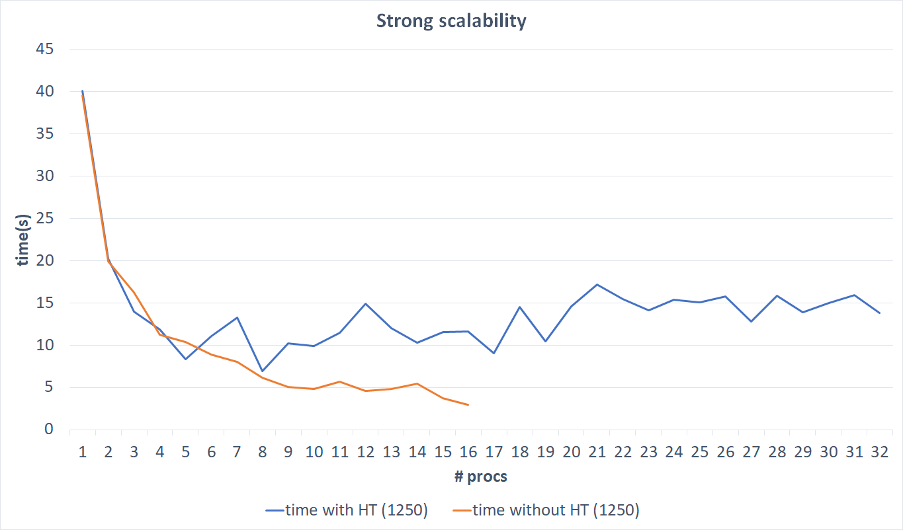

<header align="center" style="text-align:center">
<span><h1>Nbody problem with MPI</h1></span>
<i>An implementation of Nbody problem using MPI<br>
<h5>Francesco D'Auria<br>
f.dauria37@studenti.unisa.it</h5></i>
</header>

## Problem description

Il problema degli n-corpi è uno dei problemi più fertili della fisica matematica, affrontato multidisciplinarmente, per scopi diversi, dai fisici interessati alla meccanica celeste e alla fisica del sistema solare, dagli ingegneri nel calcolo di traiettorie di velivoli spaziali, e dai matematici esperti di teoria del caos, sistemi non lineari e sistemi dinamici.

Dobbiamo trovare le posizioni e le velocità di una raccolta di particelle interagenti nel tempo. Ad esempio, un astrofisico potrebbe voler conoscere le posizioni e le velocità di un gruppo di stelle. Al contrario, un chimico potrebbe voler conoscere le posizioni e le velocità di una raccolta di molecole o atomi.

Un solutore n-body è un programma che trova la soluzione a un problema n-body simulando il comportamento delle particelle. L'input al problema è la posizione e la velocità di ciascuna particella all'inizio della simulazione e l'output è in genere la posizione e la velocità di ciascuna particella in una sequenza di tempi specificati dall'utente, o semplicemente la posizione e la velocità di ciascuna particella al termine di un tempo specificato dall'utente.

**Note**<br/>
Si è considerato la soluzione quadratica nel numero di particelle. Per la parte matematica (calcolo della forza dei corpi) del problema, sono state seguite le linee guida di questa soluzione: <a href = "https://github.com/harrism/mini-nbody/blob/master/nbody.c">esempio soluzione sequenziale</a>.

Il programma deve essere in grado di simulare il processo per un determinato numero di passaggi I. Il processo MASTER inizializza un array di corpi a caso e lo invia agli altri P-1 processori . Il MASTER contribuisce al calcolo. Ogni slave simula la forza dei corpi, solo per i suoi corpi, e invia i risultati dei suoi corpi, necessari per il prossimo passo di simulazione. La parte difficile del problema è come ridurre le spese generali di comunicazione. Per la fase di inizializzazione, è stato utilizzato un algoritmo deterministico per randomizzare l'inizializzazione dei corpi. La parte importante è che l'esecuzione utilizzando uno o più processori P deve generare lo stesso output.

## Note sulla compilazione
Copiare il codice in un file e rinominarlo `nBody.c`.

Per procedere alla compilazione, utilizzare `mpicc` come segue
<center>

```bash
mpicc nBody.c -o nBody -lm 
```


</center>

e poi avviarlo con 

<center>

```bash
mpirun -np X nBody [-b|-s] N I
```

</center>

specificando in `X` il numero di processori coinvolti nell'esecuzione, in `N` il numero di particelle e in `I` il numero di iterazioni da computare. A seconda dell'opzione `-b`/`-s` si eseguirà l'algoritmo utilizzando le `MPI_Ibcast` oppure le `MPI_Isend` e le `MPI_Irecv`.

## Note sull'implementazione
L'algoritmo prevede che ad ogni processo si invii la propria porzione di array di particelle da computare. Tramite una `MPI_Scatterv`, ad ogni processo è stata inviata la propria porzione. Ogni processo però, deve inviare a tutti gli altri la propria porzione dell'array per computare il *body force* delle proprie particelle sulle altre. Per fare ciò si è proceduto in due modi
* utilizzando delle `MPI_Ibcast` 

oppure 
* delle `MPI_Isend` ed `MPI_Irecv`

tutte le chiamate sono non bloccanti ed è servito per analizzare quale delle due implementazioni può risultare più conveniente, in termini di tempo.
Siccome l'ordine di confronto tra le particelle, influisce sul risultato finale, si è scelto di attendere e  ricevere per ogni processo (in ordine) le sue particelle e poi di computare il *body force* su queste ultime, eseguendo un ciclo for per ogni processo (anche se può rallentare l'esecuzione totale dell'algoritmo).

#### Implementazione generale
La computazione è stata suddivisa tra i processi, ed anche il processo con `rank = 0` prende parte alla computazione. 

L'algoritmo utilizza due array di elementi `struct` definiti come 

```c
typedef struct
{
    float x, y, z;
} pBody;
typedef struct
{
    float vx, vy, vz;
} vBody;
```
suddividendo le componenti (x, y, z) della posizione della singola particella dalle componenti (vx, vy, vz) della velocità della stessa.

Da linea di comando, al momento dell'esecuzione sono passati due valori `N` ed `I` che rappresentano rispettivamente il numero di elementi (particelle) degli array e il numero di iterazioni da computare.

Per generare le posizioni e le velocità, la funzione `rand` è stata inizializzato con un seme con la funzione `srand(42)` in modo da avere ad ogni test, i medesimi valori delle componenti.

Si è proceduto ad instanziare i due array per le componenti delle velocità e posizioni in questo modo
```c
int bytes = nBodies * sizeof(vBody);
float *buf = (float *)malloc(bytes);
float *buf2 = (float *)malloc(bytes);
vBody *v = (vBody *)buf;
pBody *p = (pBody *)buf2;
```
calcolando la dimensione degli array in bytes, allocando fisicamente i due buffer e poi sono stati 'castati' come puntatori alle due tipologie di `struct`, `vBody` e `pBody`.
Il processo con `rank = 0` inzializza entrambi gli array con la funzione `randomizeBodies` utilizzata sia per l'array delle componenti delle velocità, sia per quelle delle posizioni. 
```c
void randomizeBodies(float *data, int n)
{
    for (int i = 0; i < n; i++)
    {
        data[i] = 2.0f * (rand() / (float)RAND_MAX) - 1.0f;
    }
}
```

Dato che le funzioni MPI possono utilizzare, come formato di invio, direttamente le `struct`, bisogna fare il create della struttura e poi fare il commit ad MPI in questo modo

```c
MPI_Datatype bodies_datatype, old_types[1];
int blockcounts[1];
MPI_Aint offset[1];
offset[0] = 0;
old_types[0] = MPI_FLOAT;
blockcounts[0] = 3;
MPI_Type_create_struct(1, blockcounts, offset, old_types, &bodies_datatype);
MPI_Type_commit(&bodies_datatype);
```
in modo tale da avere 3 float per ogni elemento 'particella' sia per la posizione che per la velocità.

Ogni processo poi calcola l'indice dell'array da cui partono e finiscono le particelle per ogni processo, con la funzione `calculateStartEnd`, così ogni processo sa dove sono posizionate le particelle degli altri processi (in seguito capiremo perché).

```c
void calculateStartEnd(int nBodies, int sizeProc, int *startIndexes, int *endIndexes)
{
    int start;
    int end;
    int resto = nBodies % sizeProc;
    int sum = 0;
    for (int i = 0; i < sizeProc; i++)
    {
        startIndexes[i] = sum;
        if (resto > 0)
        {
            end = nBodies / sizeProc + 1;
            resto--;
        }
        else
            end = nBodies / sizeProc;

        sum += --end;
        endIndexes[i] = sum + 1;
        sum++;
    }
}
...
int *startIndexes = (int *)malloc(size * sizeof(int));
int *endIndexes = (int *)malloc(size * sizeof(int));
calculateStartEnd(nBodies, size, startIndexes, endIndexes);
```
Implementando l'algoritmo con l'utilizzo degli stessi array per ricevere gli elementi degli altri processi, c'è bisogno di ulteriori due array, uno per memorizzare gli indici di inizio della porzione e uno per la fine, entrambi di dimensione uguale al numero di processi che computano. Anche se c'è bisogno di ulteriori due array, questi vengono calcolati solo una volta per tutte le iterazioni anzichè calcolare di volta in volta l'indice di inizio e fine delle particelle per ogni processo (risparmiando tempo nelle iterazioni vere e proprie, perché bisogna accedere solamente agli array in posizione `rank` per avere entrambi gli indici: più veloce accedere alla locazione dell'array piuttosto calcolare di volta in volta le posizioni). 

Sono stati calcolati i vari `sendcounts` e `displs` per utilizzare la `MPI_Scatterv`.

```c
int rem = nBodies % size;
for (int i = 0; i < size; i++)
{
    sendcounts[i] = nBodies / size;
    if (rem > 0)
    {
        sendcounts[i] += 1;
        rem--;
    }
    displs[i] = sum;
    sum += sendcounts[i];
}
```
ed è inviata ad ogni processo la propria porzione degli array.

Si procede poi con le iterazioni, descritte nella prossima sezione.

Quando si sono computate tutte le iterazioni, ogni processo invia al processo con `rank = 0` la propria porzione di entrambi gli array con due `MPI_Gatherv`. Il processo con `rank = 0`, stamperà su `stdout` entrambi gli array finali ed il tempo di esecuzione dell'algoritmo.

#### Iterazioni
Ogni processo esegue un numero di iterazioni definite dall'utente all'inizio e passate da linea di comando.

Si è scelto di implementare due soluzioni, al fine di analizzarle per definire quella che più si adatta e migliora l'algoritmo in termini di tempo e quindi di prestazioni.
In entrambe le soluzioni, si è scelto di inviare solo la porzione di array relativa alle componenti delle posizioni, poiché, per il calcolo del *body force*, ogni processo utilizza (e servono) solo le posizioni delle altre particelle, per poi aggiornare le componenti velocità delle proprie.

In un secondo momento si integrano le posizioni e le si aggiornano (componente per componente) utilizzando le velocità calcolate al punto precedente.

Una prima versione utilizza le `MPI_Ibcast`, quindi si invia in broadcast a tutti gli altri processi, la propria porzione di array di posizioni.
```c
for (int root = 0; root < size; ++root)
{
    if (root == rank)
    {
        MPI_Ibcast(&p[startIndexes[rank]], sendcounts[rank], bodies_datatype, rank, MPI_COMM_WORLD, &requests[rank]);
    }
    else
    {
        MPI_Ibcast(&p[startIndexes[root]], sendcounts[root], bodies_datatype, root, MPI_COMM_WORLD, &requests[root]);
    }
}
```
Nel primo `if` si entra quando il ciclo si è "fermato" al rank del processo che sta eseguendo il cìclo, in questo caso si invia tramite broadcasting in maniera non bloccante la propria porzione dell'array di posizioni, altrimenti se il ciclo si è "fermato" sul rank di un qualsiasi altro processo, tramite la funzione, ricevo in maniera non bloccante le altre porzioni di array (dal processo con `rank = root`).

La seconda versione, invece, utilizza le `MPI_Isend` e le `MPI_Irecv`.
```c
for (int i = 0; i < size; i++) 
{
    if (i != rank)
    {
        MPI_Isend(&p[startIndexes[rank]], sendcounts[rank], bodies_datatype, i, 0, MPI_COMM_WORLD, &requestBp);
        MPI_Irecv(&p[startIndexes[i]], sendcounts[i], bodies_datatype, i, 0, MPI_COMM_WORLD, &requests[i]);
    }
}
```
Come nella prima versione, si scorrono tutti i processi e se il ciclo non si è "fermato" sul rank del processo che sta eseguendo il ciclo (`if (i != rank)`), invio in maniera non bloccante la propria porzione di array e ricevo (non bloccante) la porzione di array dal processo con `rank = i`.

Per entrambe le soluzioni, computo il *body force* (prossima sezione) sulle particelle del processo che sta eseguendo, 

```c
bodyForce(p, v, dt, startIndexes[rank], endIndexes[rank], startIndexes[rank], endIndexes[rank]);
```

e poi per ogni processo con rank diverso dal rank del processo che sta eseguendo, mi metto in attesa (si è scelto la `MPI_Wait` anziché la `MPI_Waitany` per dare un ordine di confronto delle particelle, anche se più lenta, poiché altrimenti le particelle venivano confrontate in ordine di arrivo della altre particelle dagli altri processi; spesso non era possibile definire un ordine e i risultati erano del tutto diversi man mano che aumentavano le iterazioni) che arrivi la porzione dell'array dal processo con `rank = i` e si computa il *body force* delle particelle del processo con quelle del processo con `rank = i`
```c
for (int j = 0; j < size; j++)
{
    if (j != rank)
    {
        MPI_Wait(&requests[j], &stats);
        bodyForce(p, v, dt, startIndexes[j], endIndexes[j], startIndexes[rank], endIndexes[rank]);
    }
}
for (int i = startIndexes[rank]; i < endIndexes[rank]; i++)
{ // integrate position
    p[i].x += v[i].vx * dt;
    p[i].y += v[i].vy * dt;
    p[i].z += v[i].vz * dt;
}
```
e poi si integrano le posizioni.
Questo procedimento viene ripetuto per tutte le iterazioni.

Per ogni iterazione, i processi inviano a tutti gli altri la propria porzione di array senza passare dal processo con `rank = 0`, il quale dovrebbe suddividere ed inviare agli altri gli elementi per ogni processi: ogni porcesso già ha la porzione di array da computare per la prossima iterazione, deve solo aspettare le particelle degli altri processi.

#### Calcolo del *body force*
```c
void bodyForce(pBody *p, vBody *v, float dt, int start, int end, int myStart, int myEnd)
{
    for (int i = myStart; i < myEnd; i++)
    {
        float Fx = 0.0f;
        float Fy = 0.0f;
        float Fz = 0.0f;

        for (int j = start; j < end; j++)
        {
            float dx = p[j].x - p[i].x;
            float dy = p[j].y - p[i].y;
            float dz = p[j].z - p[i].z;
            float distSqr = dx * dx + dy * dy + dz * dz + SOFTENING;
            float invDist = 1.0f / sqrt(distSqr);
            float invDist3 = invDist * invDist * invDist;

            Fx += dx * invDist3;
            Fy += dy * invDist3;
            Fz += dz * invDist3;
        }

        v[i].vx += dt * Fx;
        v[i].vy += dt * Fy;
        v[i].vz += dt * Fz;
    }
}
```
La funzione prende in input i due array che descrivono le particelle, un float, che è il time step, due indici di inizio e fine della porzione di particelle da confrontare e due indici di inizio e fine della porzione di particelle locali al processo.
Per ognuna delle particelle associate al processo, si scorrono tutte le altre (due for annidati), identificate dalla porzione `start` ed `end` (qui si usano gli elementi dei due array `startIndexes` ed `endIndexes`) e per ogni componente, si calcola la differenza delle componenti, si sommano elevando le differenze al quadrato (aggiungendo un termine di *softening* predefinito) si calcola l'inverso della distanza e si estrae la radice dell'inverso. Poi la si eleva al cubo e si sommano il prodotto di questo cubo e la distanza sulla componente (ad un termine `F` diverso per ogni componente) per ogni particella confrontata. Calcolata questa somma per tutte le altre particelle, la si addiziona alla componente velocità moltiplicandolo prima per il time step.

## Risultati
L'algoritmo è stato testato con un numero di elementi pari a 5000, 2500 e 1250 ed un numero di iterazioni pari a 500. 

Per la scalabilità forte, di volta in volta è stato aumentato il numero di processi mantenendo costante il numero di elementi. 

Per la scalabilità debole, si è manutenuto costante il lavoro per ogni processo, aumentando di volta in volta, non solo il numero di processi, ma anche il numero di elementi.

Per scalabilità forte intendiamo
>quanto velocemente deve aumentare la dimensione del problema per mantenere un'efficienza fissa quando il numero di processi aumenta. In pratica, la dimensione totale del problema rimane uguale all'aumentare del numero di processori.

mentre per scalabilità debole intendiamo
>quanto velocemente l'efficienza diminuisce quando il numero di processi aumenta, ma il problema è risolto. In pratica, la dimensione del problema aumenta alla stessa velocità del numero di processori, mantenendo uguale la quantità di lavoro per processore.

L'hardware che si è utilizzato è il seguente, appartenente alla famiglia delle m4.xlarge :

* **4** vCPUs Processore a 2,4 GHz Intel Xeon E5-2676 v3 Intel AVX di cui **2 fisici**
* **16** GiB memoria RAM
* **8** GiB storage (solo EBS)

Di questa famiglia di macchina, ne sono state utilizzate 8, poichè è il limite imposto dal programma *AWS Educate* (max 32 vCPUs totali).

Siccome le macchine hanno 4 vCPU di cui 2 core fisici, si è proceduto ad una suddivisione dei risultati
* usando l'hyperthreading (sfruttando tutte le vCPUs per ogni macchina) arrivando all'utilizzo di 32 vCPUs
* senza l'uso dell'hyperthreading (sfruttando solo 2 CPUs per ogni macchina, solo i core fisici), arrivando ad usare 16 vCPUs.

L'hyperthreading  
>consente l'esecuzione di più thread su ciascun core. Più thread attivi significano più lavoro svolto in parallelo. La CPU genera due contesti di esecuzione per ogni core fisico. Questo significa che un singolo core fisico funziona come due "core logici", in grado di gestire diversi thread software.

Molto spesso, con l'utilizzo dell'HT, le prestazioni degradano, dovuto al fatto che ci sono due processi che condividono lo stesso core fisico, ma anche perché non si ha sotto controllo il cluster (in termini di specifiche tecniche) e non si ha la certezza di come si comporta per operazioni HPC.

I risultati presentano un'alta varianza, dovuto al fatto che le macchine vengono eseguite in una *sandbox* e non ci sono tutte le garanzie che si stia eseguendo l'algoritmo su un cluster HPC, poichè non abbiamo in nessun modo, ad esempio, informazioni circa la banda minima e massima garantita tra le macchine (potrebbe in qualche caso diminuire la banda di trasmissione e ciò potrebbe inficiare le prestazioni totali). 

Una volta raccolti i dati delle esecuzioni, sono stati plottati su grafici per avere una panoramica e l'andamento (in termini di tempo) dell'algoritmo.

Per la scalabilità forte si è calcolato anche lo speedup e l'efficienza come segue

<center>

&nbsp;&nbsp;

</center>

È stato plottato l'andamento anche di questi due valori al variare dei processi utilizzati.

I grafici che seguono sono suddivisi a seconda del numero di elementi che si trovano su una riga o colonna della matrice, che è rappresentativo della dimensione della matrice. 

Per ogni grafico, sono stati plottati entrambi i comportamenti (con HT e senza).

Un'ulteriore sezione contiene i grafici riassuntivi suddivisi a loro volta secondo i due comportamenti.

L'ultima sezione contiene i grafici comparativi sulla Strong Scalability e Weak Scalability utilizzando le send e receive oppure le broadcast con un numero di elementi negli array pari a 5000.
#### Scalabilità debole
##### SIZE = 5000 I = 500


##### SIZE = 2500 I = 500


##### SIZE = 1250 I = 500


#### Scalabilità forte
##### SIZE = 5000 I = 500


##### SIZE = 2500 I = 500


##### SIZE = 1250 I = 500


#### Speedup
##### SIZE = 5000 I = 500


##### SIZE = 2500 I = 500


##### SIZE = 1250 I = 500


#### Efficienza
##### SIZE = 5000 I = 500


##### SIZE = 2500 I = 500


##### SIZE = 1250 I = 500


#### Grafici riassuntivi
<center>


</center>
<center>


</center>
<center>


</center>
<center>


</center>

#### Bcast vs Send-Receive (5000 elementi)
<center>


</center>

## Descrizione dei risultati
Dai grafici si evince che, l'algoritmo proposto scala molto bene con valori di input elevati e numero di processi via via crescente ma solo senza l'utilizzo di hypertheading. 
Trattandosi di un problema `embarrassing parallelizable`, per esecuzioni senza l'utilizzo di HT, si comporta molto meglio.

Lanciando due processi sullo stesso core, le prestazioni vanno degradando perché si va a saturare la reale capacità di computazione del core ed anche l'efficienza e lo speedup ne risentono, passando da uno speedup di quasi 4 con 8 processi ad uno speedup di 3 con 32 processi in HT. L'efficienza rispecchia anch'essa lo speedup passando dal 90% con 3 processi a quasi il 10% con 32 processi in HT. Il picco di speedup lo si è avuto con l'utilizzo di 8 processi ma comunque si tratta di uno speedup abbastanza basso (circa 4). Mentre l'efficienza massima (senza prendere in considerazione l'esecuzione con singolo processo), si è avuto con 2 processi (circa il 99%). Anche la scalabilità debole mostra questi cambi repentini, dovuti ad una maggiore comunicazione tra processi con un andamento piuttosto lineare crescente progressivamente con il numero di processi. Questi risultati non possono che essere non veritieri, poiché il cluster in questione non è un cluster HPC ed in più non si possono fare delle considerazioni su tutto quello che non è specificato nelle specifiche tecniche delle macchine utilizzate. In più, essendo macchine in AWS, anche se riservate, ed essendo state noleggiate con crediti messi a disposizione con il programma *AWS Educate* (vengono eseguite in una sand-box), fanno pensare, che queste basse prestazioni siano dovute a tutto ciò e non alla implementazione dell'algoritmo.

Diverso è il discorso senza l'utilizzo di HT e le prestazione sono da considerare piuttosto accettabili. La scalabilità debole si mantiene quasi costante, per tutti i valori di input e numeri di processi con i quali viene eseguito l'algoritmo. Un cambiamento è stato osservato intorno ai 9 - 10 processi, ma comunque il tempo è ancora accettabile, mettendolo in confronto con il relativo tempo con HT. Con gli stessi valori in input, l'algoritmo scala molto bene, con l'aumentare del numero di processi, passando da quasi 200 secondi con un singolo processo (versione sequenziale) a 19 secondi con 16 processi. Ciò si evince anche dallo speedup, raggiungendo un massimo di 10 in corrispondenza di 16 processi (la crescita si mantiene in questo caso costante). L'efficienza è nettamente migliorata rispetto ad utilizzare l'HT raggiungendo soglie di 90% - 80% rispetto alla esecuzione sequenziale, decrescendo man mano fino a 65% con 16 processi.

Il comportamento è molto simile per tutte le taglie di input testate, e questa similitudine è apprezzata molto meglio nei grafici dello speedup ed efficienza (tranne che per casi particolari).

Si è voluto confrontare anche l'ultizzo di `MPI_bcast` con le rispettive `MPI_Send` e `MPI_Recv`. Sia nella scalabilità forte che in quella debole, la broadcast si comporta meglio, però non di molto (2 - 3 s) sia in HT che non. L'andamento si mantiene comunque costante per qualsiasi numero di processi. La differenza è più apprezzabile per numero di processi via via più grandi con una differenza di circa 3 s senza HT. Si è notato che questa differenza diminuisce con l'uso di HT. Avendolo testato con numero di elementi abbastanza piccoli (5000) ed all'aumentare del numero di elementi, la differenza tra l'utilizzo di broadcast piuttosto di send-receive diverrà sempre maggiore, e ciò vuol dire che si dovrebbe preferire l'utilizzo di routine più appropriate ad ogni scopo specifico (in questo caso l'invio dei propri elementi a tutti gli altri processi senza distinzione di rank). 

## Conclusioni
Con questo progetto si è voluto presentare una versione dell'algoritmo che computa Nbody su un numero di elmenti N per un numero I iterazioni. La soluzione proposta sfrutta la suddivisione in porzioni di array ad ogni processo. È stato testato per diversi valori di input aggiungendo o sottraendo un processo alla volta. Si è notato, come l'utilizzo di *hyperthreading*, anche su macchine ottimizzate per il calcolo, rallenta di molto il tempo di esecuzione dell'algoritmo e di conseguenza lo speedup e l'efficienza. 